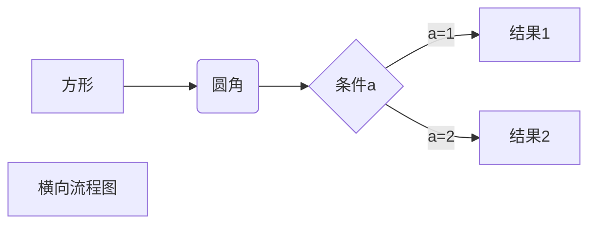
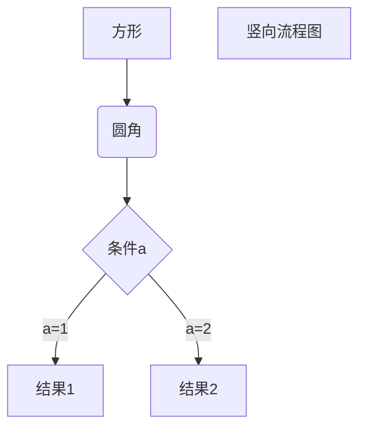
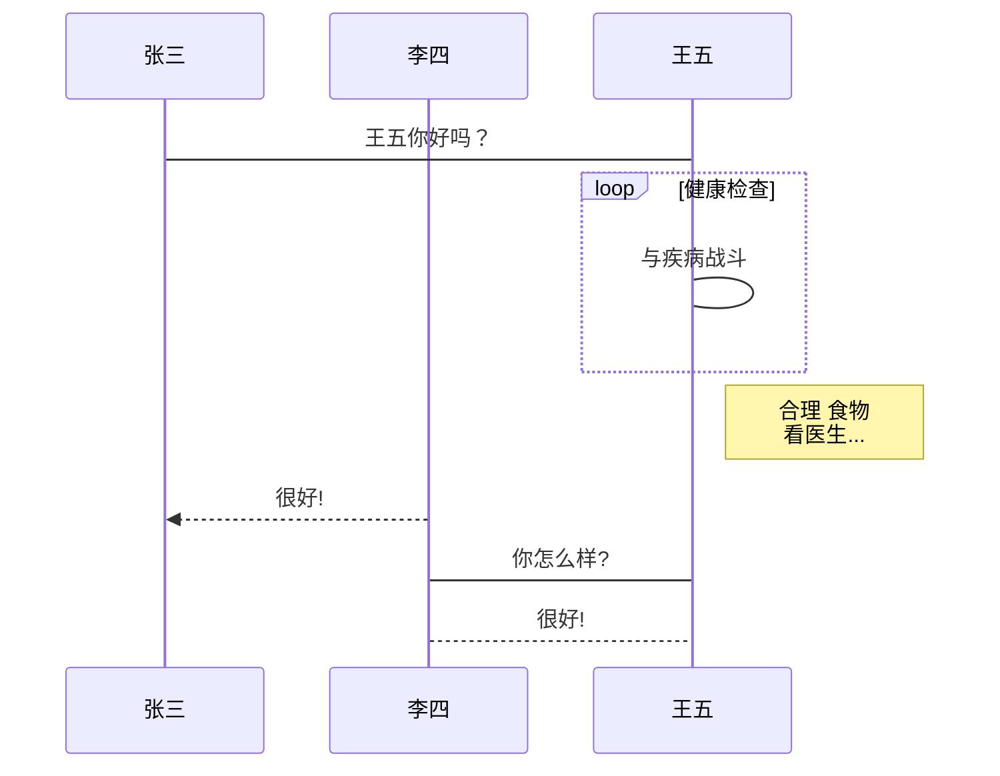
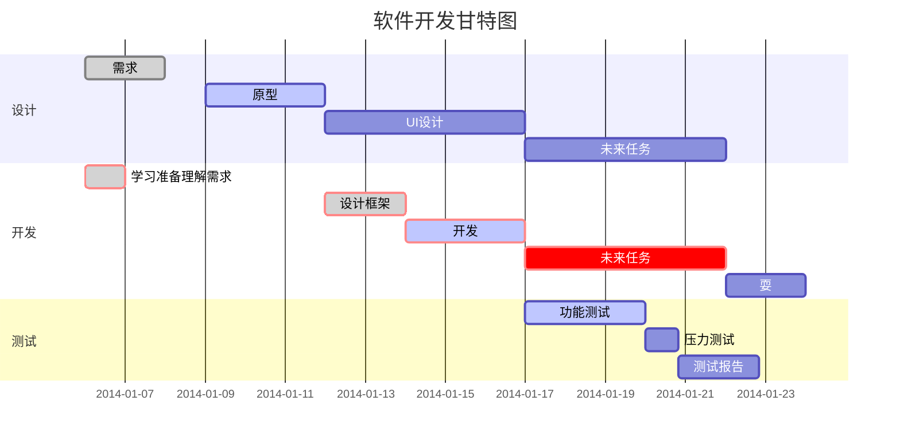

# MarkDown


## 一、标题

略

## 二、段落格式

段落的换行是使用两个以上空格加上回车。

## 三、字体

*斜体*

_斜体_

**粗体**

__粗体__

***粗斜体***

___粗斜体___

## 四、分割线

***

******

*** ***

*** **** ****

---

-----

-----------------

## 五、删除线

~~删除线~~

## 六、下划线

<u>下划线</u>

## 七、脚注

这是脚注[^要注明的文本]

[^要注明的文本]:这是要注明的文本

## 八、列表

无序列表

* 第一项
* 第二项
* 第三项


+ 第一项


- 第一项


有序列表

1. 第一项
2. 第二项


### 列表嵌套

列表嵌套只需在子列表中的选项前面添加四个空格即可

1. 第一项
       * 第一项子项1
       * 第一项子项2

2. 第二项
   + 第二项子项1
   + 第二项子项2


## 九、区块

> 区块引用
>
> 菜鸟教程

区块嵌套

> 最外层
>
> > 第一层
> >
> > > 第二层


区块中使用列表

> 区块中使用列表
>
> 1. 第一项
> 2. 第二项
>
> + 第一项


列表中使用区块

- 第一项

  > 菜鸟教程
  >
  > 今天袁隆平院士去世了
  >
  > 还有吴孟超院士
  >
  > 无双国士


# 十、代码

`printf()`函数

代码区块

```java
System.out.println("");
```


## 十一、链接

[链接名称](链接地址)

或者

<www.baidu.com>

高级链接

这个链接用1作为网址变量[Google][1]

这个链接用runoob作为网址变量[Roonoob][runoob]

[1]:http://www.google.com/
[roonoob]:http://www.runoob.com/

 

## 十二、图片


也可以像网址那样对图片网址使用变量

这个链接作为网址变量[runoob][1].

[1]:http://static.runoob.com/images/runoob-logo.png


可以使用普通img标签


## 十三、表格

| 表头 | 表头 |
| :--: | :--: |
| 内容     | 内容     |


## 十四、高级技巧

支持HTML元素

使用<kbd>Ctrl</kbd>+<kbd>Alt</kbd>+<kbd>Del</kbd>重启电脑

<br>

<i>i标签</i>

<h1>h1标签</h1>


转义\\

**文本加粗**

\*\*正常星号\*\*


公式

$$
\mathbf{V}_1 \times \mathbf{V}_2 =  \begin{vmatrix} 
\mathbf{i} & \mathbf{j} & \mathbf{k} \\
\frac{\partial X}{\partial u} &  \frac{\partial Y}{\partial u} & 0 \\
\frac{\partial X}{\partial v} &  \frac{\partial Y}{\partial v} & 0 \\
\end{vmatrix}
${$tep1}{\style{visibility:hidden}{(x+1)(x+1)}}
$$


## 其他

使用typora画流程图、时序图（顺序图）甘特图
1、横向流程图


2、竖向流程图源码格式：

3、标准流程图源码格式：
```flow
st=>start: 开始框
op=>operation: 处理框
cond=>condition: 判断框(是或否?)
sub1=>subroutine: 子流程
io=>inputoutput: 输入输出框
e=>end: 结束框
st->op->cond
cond(yes)->io->e
cond(no)->sub1(right)->op
```
4、标准流程图源码格式（横向）：
```flow
st=>start: 开始框
op=>operation: 处理框
cond=>condition: 判断框(是或否?)
sub1=>subroutine: 子流程
io=>inputoutput: 输入输出框
e=>end: 结束框
st(right)->op(right)->cond
cond(yes)->io(bottom)->e
cond(no)->sub1(right)->op
```
5、UML时序图源码样例：
```sequence
对象A->对象B: 对象B你好吗?（请求）
Note right of 对象B: 对象B的描述
Note left of 对象A: 对象A的描述(提示)
对象B-->对象A: 我很好(响应)
对象A->对象B: 你真的好吗？
```
6、UML时序图源码复杂样例：
```sequence
Title: 标题：复杂使用
对象A->对象B: 对象B你好吗?（请求）
Note right of 对象B: 对象B的描述
Note left of 对象A: 对象A的描述(提示)
对象B-->对象A: 我很好(响应)
对象B->小三: 你好吗
小三-->>对象A: 对象B找我了
对象A->对象B: 你真的好吗？
Note over 小三,对象B: 我们是朋友
participant C
Note right of C: 没人陪我玩
```

7、UML标准时序图样例：

8、甘特图样例：

